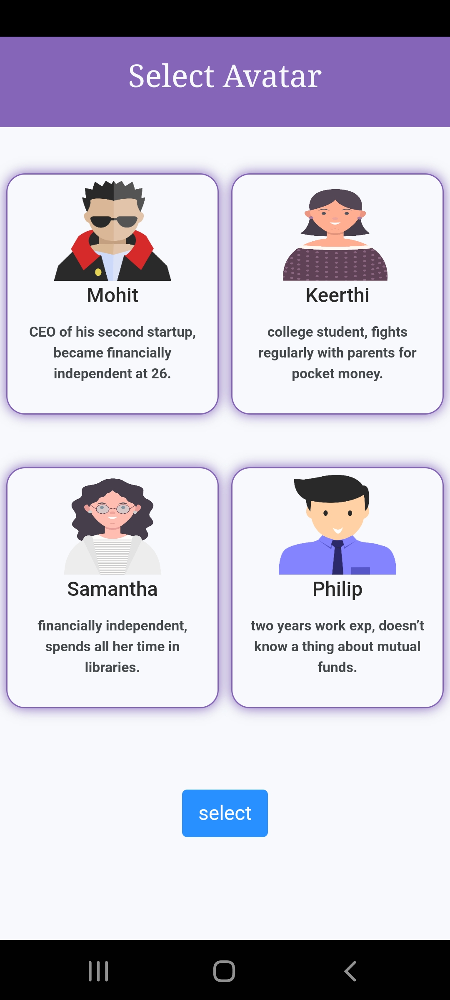
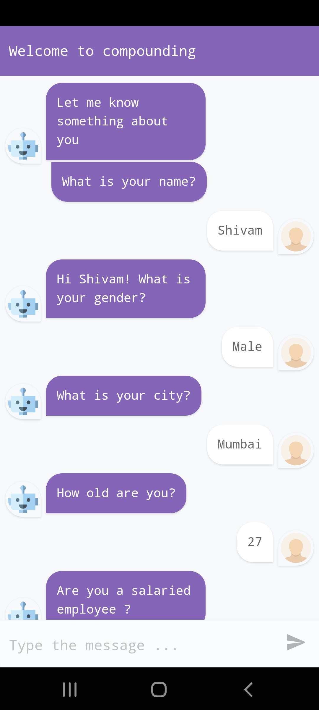
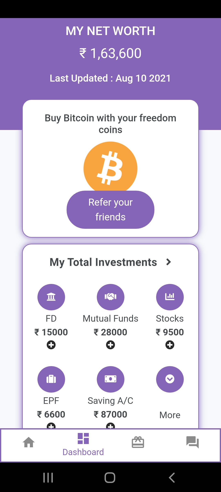
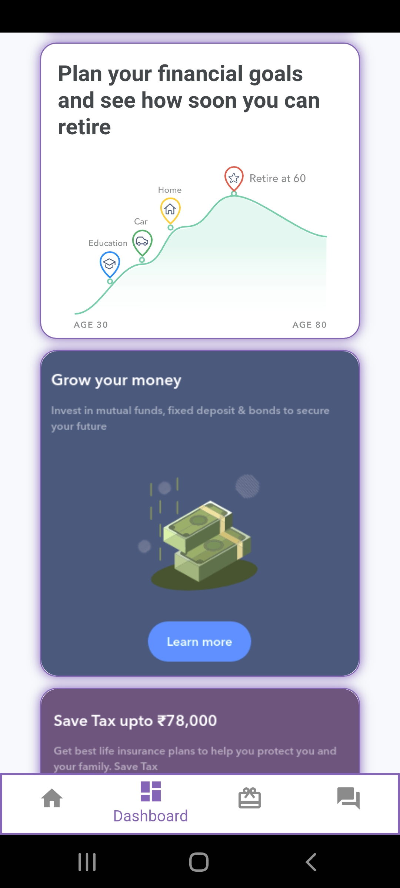
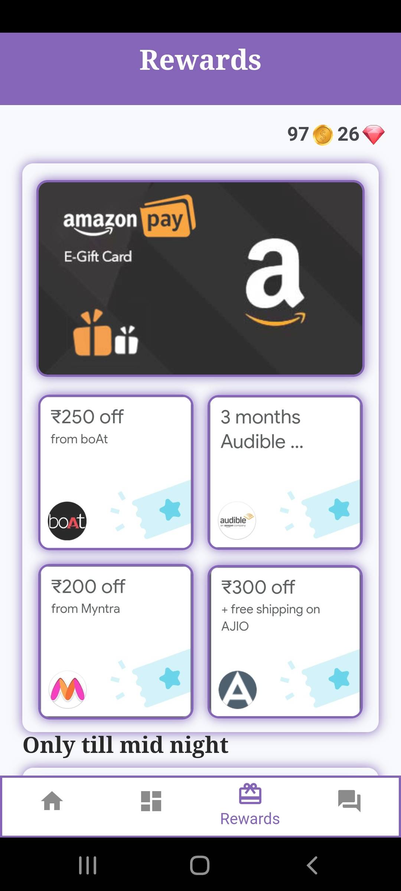
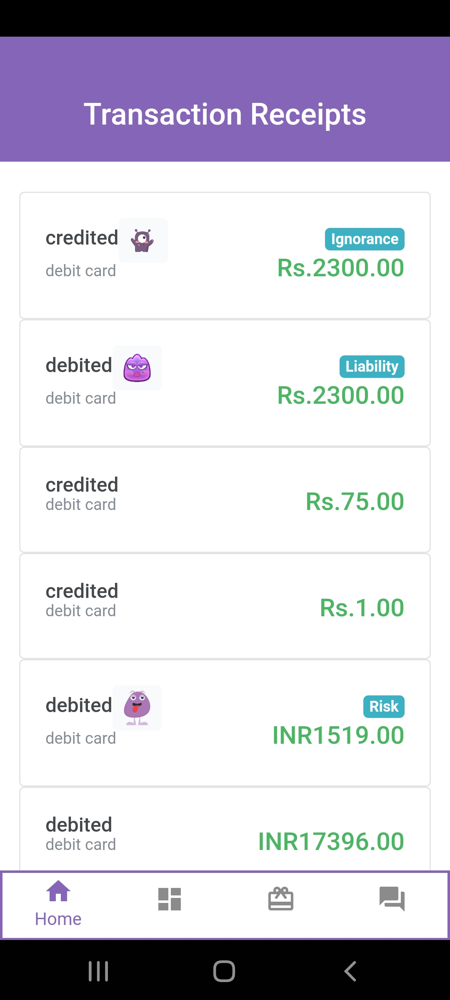
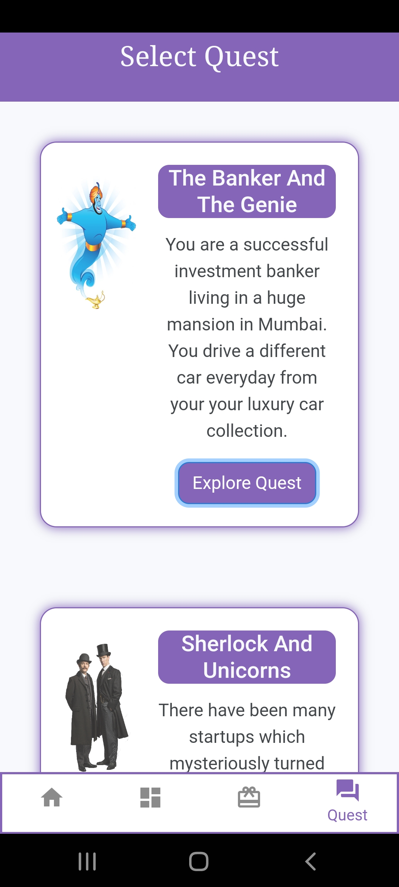

#Compounding

>##### Gamyfing Finance Management

<h6>
    Gamifying finance. An application which makes people more interested towards trading and other ways that can bring them a financial growth. It also helps them to learn and get rewards in return.

</h6>

 

>Screenshots

 
<h6 style="margin-left:100px;width:fit-content;background:lightgray;padding:10px;border-radius:20px">Create avatar</h6>

 
<h6 style="margin-left:100px;width:fit-content;background:lightgray;padding:10px;border-radius:20px">Intro bot</h6>

 
<h6 style="margin-left:100px;width:fit-content;background:lightgray;padding:10px;border-radius:20px">Manage Expenses</h6>

 
<h6 style="margin-left:100px;width:fit-content;background:lightgray;padding:10px;border-radius:20px">Dashboard</h6>

 
<h6 style="margin-left:100px;width:fit-content;background:lightgray;padding:10px;border-radius:20px">Rewards</h6>

 
<h6 style="margin-left:100px;width:fit-content;background:lightgray;padding:10px;border-radius:20px">Transactions</h6>

 
<h6 style="margin-left:100px;width:fit-content;background:lightgray;padding:10px;border-radius:20px">Solo/Group Quests</h6>